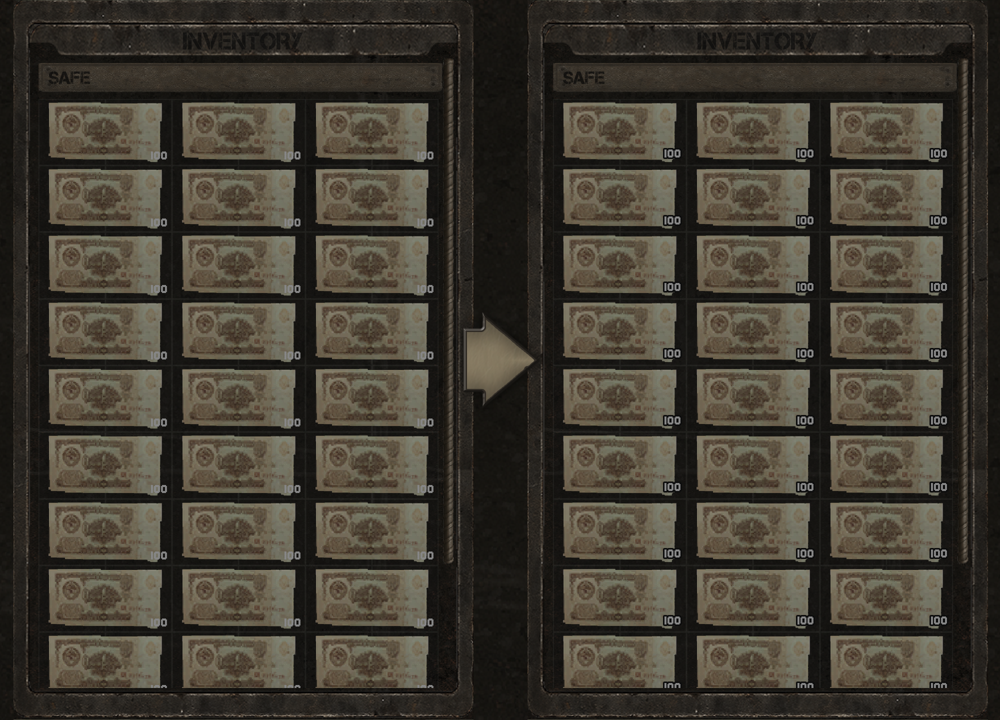
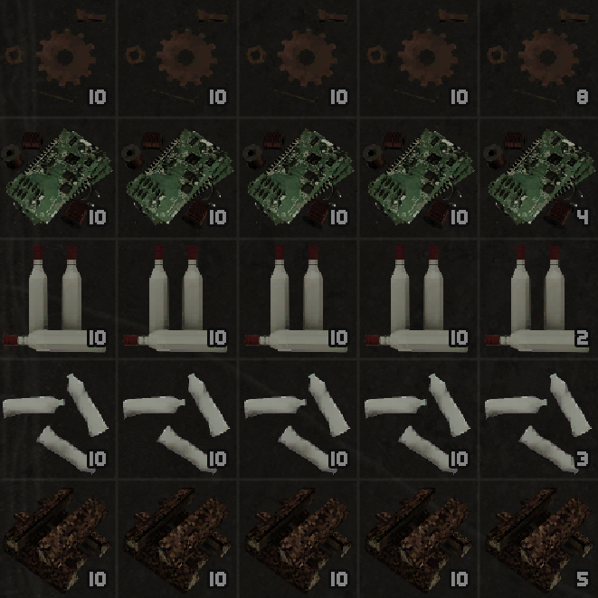

<div align="center">

# StackTextOutline

A small UE4SS mod that adds an outline to item stack numbers to improve visibility against light backgrounds.


Also available on [Nexus Mods](https://www.nexusmods.com/misery/mods/32).

</div>

---

## Overview

It's particularly hard to see the number on stacks of rubles, this mod aims
to solve that by adding a dark outline to stack count numbers, making them a
lot easier to read.

I did my best to match the outline to the tones used by the game, but if
you'd like to mess with any of the values, just edit the configuration
variables right at the start of the `main.lua` file.

> [!NOTE]
> The outline is applied to every item stack, not just rubles.

## Preview

Before (left) vs. after (right):



Outlined stack counts of crafting materials:



## Features

- **Global coverage**: hooks `NotifyOnNewObject` on `/Script/UMG.TextBlock`,
  so every stack counter gets outlined as soon as it's created, not just the
  ones visible on load.
- **Smart exclusions**: skips repair-cost text and the ammo counters on
  equipped weapon slots, so the outline only touches actual stack amounts.
- **Configurable**: outline size, color, and alpha are plain variables at the
  top of the script.

## Requirements

**Requires [UE4SS](https://github.com/UE4SS-RE/RE-UE4SS) to work.**

Tested on the latest experimental release at the time of writing
(`UE4SS_v3.0.1-969-gd90375c8`). Grab the current one from the
[releases page](https://github.com/UE4SS-RE/RE-UE4SS/releases/tag/experimental-latest).

## Installation

1. Unzip the UE4SS release and place both the `ue4ss` folder and `dwmapi.dll` inside:

   ```
   C:\Program Files (x86)\Steam\steamapps\common\MISERY\MISERY\Binaries\Win64
   ```

2. Unzip `StackTextOutline.zip` and place the `StackTextOutline` folder inside:

   ```
   C:\Program Files (x86)\Steam\steamapps\common\MISERY\MISERY\Binaries\Win64\ue4ss\Mods
   ```

3. Add the following line to the `mods.txt` file in that same `Mods` folder to
   enable it:

   ```
   StackTextOutline : 1
   ```

## Configuration

Edit the constants at the top of
[`StackTextOutline/scripts/main.lua`](StackTextOutline/scripts/main.lua):

```lua
local OUTLINE_SIZE  = 2      -- 0+
local OUTLINE_RED   = 0.004  -- 0.0–1.0
local OUTLINE_GREEN = 0.004  -- 0.0–1.0
local OUTLINE_BLUE  = 0.004  -- 0.0–1.0
local OUTLINE_ALPHA = 1.0    -- 0.0 (transparent) – 1.0 (opaque)
```

## Project Structure

```
MISERY-StackTextOutline/
└── StackTextOutline/
    └── scripts/
        └── main.lua   # Hooks TextBlock creation and applies the outline
```
